# mck-consult Skill Complete Workflow

```mermaid
graph TB
    Start[User enters business problem] --> Step1[STEP 1: Define problem boundaries]
    
    Step1 --> Step1_Output[Output: Is & Isn't list]
    Step1_Output --> Step1_Review{UserReview}
    Step1_Review -->|Adjustment| Step1
    Step1_Review -->|Confirm| Step2
    
    Step2[STEP 2: Establish Issue Tree] --> Step2_Process[MECE principle dismantling 2-3 layers]
    Step2_Process --> Step2_Output[Output: Structured problem tree<br/>Lv1→Lv2→Lv3]
    Step2_Output --> Step2_Review{UserReview}
    Step2_Review -->|Adjust nodes| Step2
    Step2_Review -->|Confirm| Step3
    
    Step3[STEP 3: Form Hypotheses] --> Step3_Process[Quick web_search<br/>5-10 searches]
    Step3_Process --> Step3_Output[Output: Hypothesis Tree<br/>+ Storyline]
    Step3_Output --> Step3_Review{UserReview}
    Step3_Review -->|Modify hypothesis| Step3
    Step3_Review -->|Confirm| Step4
    
    Step4[STEP 4: Determine the argument method] --> Step4_Process[Select for each hypothesis:<br/>- Argument method<br/>- Information source]
    Step4_Process --> Step4_Output[Output: Demonstration plan<br/>+ Data requirements list]
    Step4_Output --> Step5
    
    Step5[STEP 5: Design Dummy Pages] --> Step5_Process[Design for each hypothesis:<br/>- Page layout<br/>- Chart type<br/>- McKinsey specification]
    Step5_Process --> Step5_Output[Output: Complete Dummy Pages design<br/>Detailed specifications of each page]
    Step5_Output --> Step5_Review{UserReview}
    Step5_Review -->|Adjust design| Step5
    Step5_Review -->|Confirm| Step6
    
    Step6[STEP 6: Data collection] --> Step6_Process[Execute web_search<br/>15-30 searches]
    Step6_Process --> Step6_Output[Output: structured data set]
    Step6_Output --> Step7
    
    Step7[STEP 7: Generate PPT] --> Step7_Process[Call mckinsey-ppt-v4<br/>Generate the first version of PPT]
    Step7_Process --> Step7_Output[Output: First version of PPT<br/>pages 15-25]
    Step7_Output --> Step8
    
    Step8[STEP 8: Iterative Optimization] --> Step8_User[User View PPT<br/>Annotation Issues]
    Step8_User --> Step8_Fix{Any problem?}
    Step8_Fix -->|Yes| Step8_Repair[Claude's targeted repairs:<br/>- Color contrast<br/>- Element occlusion<br/>- Text overflow<br/>- Content splitting]
    Step8_Repair --> Step8_Output[Output: optimized version of PPT]
    Step8_Output --> Step8_User
    Step8_Fix -->|No| Final
    
    Final[Output: Ultimate McKinsey PPT] --> End[Complete!]
    
    style Start fill:#C9F0FF
    style Final fill:#FFDB00
    style End fill:#90EE90
    style Step1 fill:#0065BD,color:#fff
    style Step2 fill:#0065BD,color:#fff
    style Step3 fill:#0065BD,color:#fff
    style Step4 fill:#002960,color:#fff
    style Step5 fill:#002960,color:#fff
    style Step6 fill:#002960,color:#fff
    style Step7 fill:#002960,color:#fff
    style Step8 fill:#002960,color:#fff
```



## Detailed process description

### 🔵 PHASE 1: Hypotheses Tree (hypothesis tree)

#### STEP 1: Define problem boundaries ⏱️ 5 minutes
**Input**: User’s business problem description
**Process**:
- Claude asks clarifying questions
- Align research goals, scope, and delivery format with users
**Output**:
```markdown
## Problem definition
### Yes ✅
- [Core Objective]
- [Research Scope]
### No ❌
- [Excluded content]
```
**User Action**: Review and confirm or adjust

---

#### STEP 2: Create Issue Tree ⏱️ 8 minutes
**Input**: clear problem definition
**Process**:
- Decompose based on business logic using MECE principles
- Automatically generate 2-3 layer problem trees
**Output**:
```markdown
## Issue Tree
### Lv1: Top-level problem
  #### Lv2: Sub-question 1
    - Lv3: Sub-sub question 1.1
    - Lv3: Sub-sub question 1.2
  #### Lv2: Sub-question 2
```
**User Action**: Review and adjust nodes (if necessary)

---

#### STEP 3: Form Hypotheses ⏱️ 12 minutes
**Input**: Issue Tree
**Process**:
1. Reasoning based on common sense
2. Execute 5-10 times of quick web_search to obtain the frame
3. Form a hypothesis for each Issue
4. Organize into a coherent storyline
**Output**:
```markdown
## Hypothesis Tree
**H1**: Core hypothesis 1
  - H1.1: Supporting hypothesis
  - H1.2: Supporting hypothesis
**H2**: Core hypothesis 2
### Data points that need to be verified
1. [Data Point 1]
2. [Data Point 2]
```
**User Action**: Review and modify the hypothesis (if necessary)

---

### 🔷 PHASE 2: Dummy Pages (page design)

#### STEP 4: Determine the argument method ⏱️ 10 minutes
**Input**: Hypothesis Tree
**Process**:
- Choose a demonstration method (model/scale/framework/case/visualization) for each hypothesis
- Determine information sources and search strategies
**Output**:
```markdown
## Argument plan
### H1: [Hypothesis 1]
#### Argument page 1
- Argument method: scale analysis
- Information source: Industry reports + corporate financial reports
- Key data points: [...]
```

---

#### STEP 5: Design Dummy Pages ⏱️ 15 minutes
**Input**: Argument plan
**Process**:
- Design McKinsey style layout for each argument page
- Determine chart type, page structure, and McKinsey specifications
- List precise data requirements
**Output**:
```markdown
### Page X: [McKinsey Argument Title]
**Page layout**: title + single chart shape
**Chart Type**: Stacked Column Chart
**Data Requirements**:
- X-axis: [...]
- Y axis: [...]
- Series: [...]
**McKinsey Design Key Points**:
- Color: [...]
- Annotation: [...]
- Insight Box: [...]
```
**User Action**: Review design (if necessary)

---

### 🔶 PHASE 3: Data & Generation (data and generation)

#### STEP 6: Data collection ⏱️ 20 minutes
**Input**: Dummy Pages design
**Process**:
- Execute web_search 2-5 times for each Dummy Page
- 15-30 searches in total
- Verify key data from multiple sources
**Output**: Structured data set (JSON/table format)

---

#### STEP 7: Generate PPT ⏱️ 10 minutes
**Input**: Dummy Pages design + dataset
**Process**:
1. Call mckinsey-ppt-v4 skill
2. Generate each page based on design and data
3. Apply McKinsey Design Code
4. Perform quality checks
**Output**: First version of PPT (pages 15-25)

---

#### STEP 8: Iterative optimization ⏱️ 5-20 minutes (2-4 rounds)
**Input**: First version of PPT
**Process**:
**Round 1**: User views and marks the question
**Round 2**: Claude targeted repairs
  - Color contrast issues
  - Element occlusion problem
  - Text overflow problem
**Round 3**: User re-check
**Round 4**: (if necessary) content splitting/detail polishing
**Output**: Ultimate version PPT ✨

---

## ⏰ Total Time Estimation

| Stage | Time | Notes |
|-----|------|------|
| STEP 1 | 5 minutes | Problem definition |
| STEP 2 | 8 minutes | Issue Tree |
| STEP 3 | 12 minutes | Hypotheses (with quick search) |
| STEP 4 | 10 minutes | Argument method |
| STEP 5 | 15 minutes | Dummy Pages |
| STEP 6 | 20 minutes | Data collection (15-30 searches) |
| STEP 7 | 10 minutes | PPT generation |
| STEP 8 | 10-20 minutes | Iterative optimization (2-4 rounds) |
| **Total**|**90-110 minutes**|**About 1.5-2 hours**|

---

## 🎯 Critical Success Factors

### 1️⃣ The problem definition must be accurate
- Is & Isn't must be clear
- Avoid ranges that are too large or too small

### 2️⃣Issue Tree requires MECE
- Each layer avoids overlaps and gaps
- Prioritize layers 2-3, don’t drill too deep at the beginning

### 3️⃣ Hypothesis must be verifiable
- Hypotheses are not guesses, they must be supported by logic
- Must know what data can prove/false

### 4️⃣ Dummy Page needs details
- The page layout should be specific to the chart type
- Data requirements must be accurate to X-axis/Y-axis/series

### 5️⃣ Data must be verified from multiple sources
- At least 2-3 sources of key data
- Prioritize corporate financial reports > Authoritative institutions > Media

### 6️⃣ PPT needs to be optimized iteratively
- The first edition does not seek perfection.
- 2-3 rounds of iteration to reach the final version

---

## 🚨 FAQs and pitfalls to avoid

### Question 1: Issue Tree disassembly does not follow MECE

**Performance**:
- There is overlap between branches
- Missing important dimensions

**Solution**:
- Use the standard disassembly framework (market = users × penetration rate × payment rate × customer unit price)
- Check MECE after each layer is completed

---

### Question 2: Assumption lacks logical support
**Performance**:
- Based only on gut feeling
- Verification data not found

**Solution**:
- Quick web_search to get frame information
- Form hypotheses based on common sense + search

---

### Problem 3: Dummy Page design is not detailed enough
**Performance**:
- Just said "make a graph" but doesn't know what kind of graph it is
- Ambiguous data requirements

**Solution**:
- Clarify the chart type (bar chart/line chart/matrix chart)
- List the specific content of the X-axis/Y-axis/series/label

---

### Problem 4: Insufficient color contrast
**Performance**:
- Dark blue background + dark blue text invisible

**Solution**:
- **Mandatory Rule**: Dark blue background must have white text
- Automatically check and fix after generation

---

### Problem 5: Content density is too high
**Performance**:
- 10+ key points squeezed into a single page
- Text overflow

**Solution**:
- Split into 2-3 pages
- Streamline text and replace long sentences with bullet points

---

## 📚 Best Practices

### ✅ DO

1. **Communicate more during the problem definition stage** - Make sure the direction is correct
2. **Build the Issue Tree with 2 layers first** - Do not break it down too finely at the beginning
3. **Base assumptions on quick search** - Do not work behind closed doors
4. **Design detailed Dummy Pages** - Lay a good foundation for PPT generation
5. **Verify data with multiple sources** - Ensure reliability
6. **Run multiple rounds of PPT iteration** - The first version does not seek perfection

### ❌ DON'T

1. **Don’t skip the problem definition** - otherwise you may go in the wrong direction
2. **Don’t make the Issue Tree too deep** - it is easy to get lost
3. **Don’t create too many assumptions** - focus on 3-5 core assumptions
4. **Don’t make Dummy Pages too simple** - otherwise generated quality will be poor
5. **Don’t search only once** - verify data from multiple sources
6. **Don’t pursue perfection in the first version** - it wastes time

---

**Ready to get started? Let the mck-consult skill help solve your business problem!** 🚀